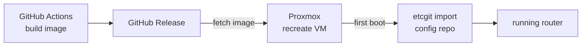

# Actions-OpenWrt — a rebuildable router

[](https://github.com/novkostya/Actions-OpenWrt/actions/workflows/build-openwrt.yml)
[](LICENSE)

Personal setup that builds a custom OpenWrt image for an **x86‑64 router VM on Proxmox** with GitHub
Actions, and runs that router as **cattle, not a pet**. Built on the
[P3TERX/Actions-OpenWrt](https://github.com/P3TERX/Actions-OpenWrt) template (see [Credits](#credits)).

> Personal, home‑use project. Shared in case the approach is useful; no support implied.

## The idea

A home router accumulates state you can't reproduce — packages installed at 2 a.m., a firewall rule you
forgot, config that only ever existed on the box. When it dies or you change hardware, you're stuck. This
repo splits the router into two reproducible halves so it can be thrown away and rebuilt in minutes:

- **The image** is built by CI from a pinned OpenWrt source and published as a GitHub Release, with
  everything I need baked in. It's defined here and rebuilt rather than hand‑crafted on the box, so I can
  wipe the router and get the same image back.
- **The configuration** (`/etc`) lives in a **separate git repo**, pulled onto the device on first boot and
  then version‑controlled *live* on the running router via a small helper, `etcgit`. Overlay hygiene keeps
  that history honest, so it only shows changes I actually made — not firmware defaults.

So the router is just **image + config**, and recreating it is "fetch the latest release, recreate the VM,
`etcgit import`."

## Rolling it out on Proxmox



The essence on the PVE host (**illustrative — not a runnable script**; `<…>` are placeholders):

```sh
# Fetch the freshly built image from the latest Release
curl -L -o openwrt.img.gz \
  https://github.com/novkostya/Actions-OpenWrt/releases/latest/download/openwrt-x86-64-generic-squashfs-combined-efi.img.gz
gunzip -f openwrt.img.gz

# (Re)create the VM, import the disk, pass the real NICs through, boot
qm create 100 --name openwrt --machine q35 --bios ovmf --ostype l26 --cpu host
qm importdisk 100 openwrt.img local-zfs
qm set 100 --scsihw virtio-scsi-pci --scsi0 local-zfs:vm-100-disk-0 --boot order=scsi0
qm set 100 --hostpci0 <wan-nic> --hostpci1 <lan-nic>
qm start 100

# Then, in the VM console on first boot: add an SSH key and pull the config
etcgit import git@github.com:<you>/<openwrt-config>.git
```

## Credits

Built on **[P3TERX/Actions-OpenWrt](https://github.com/P3TERX/Actions-OpenWrt)** — the "Building OpenWrt with
GitHub Actions" template that provides the workflow skeleton and `custom-*.sh` hook layout. This setup points
the build at official OpenWrt, targets an x86‑64 Proxmox VM, and adds the `etcgit` / overlay tooling. Also
builds on [OpenWrt](https://github.com/openwrt/openwrt) and the packages and GitHub Actions the workflows
pull in.

## License

[MIT](LICENSE) © 2019–2020 [P3TERX](https://p3terx.com) (original template), with modifications by the
repository owner.
